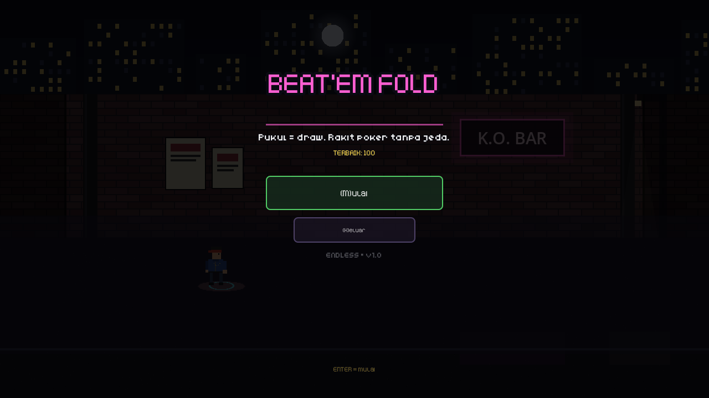
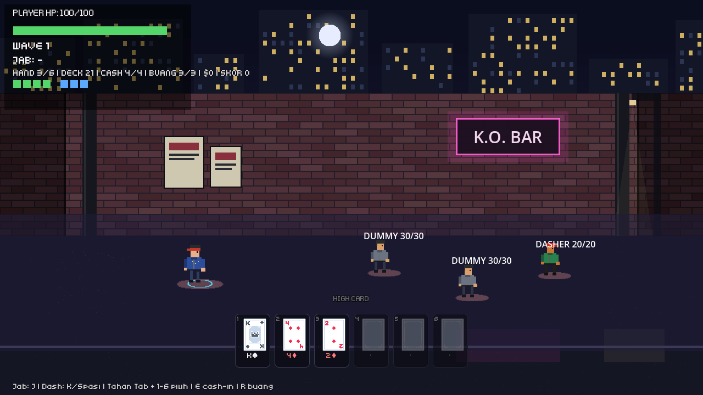
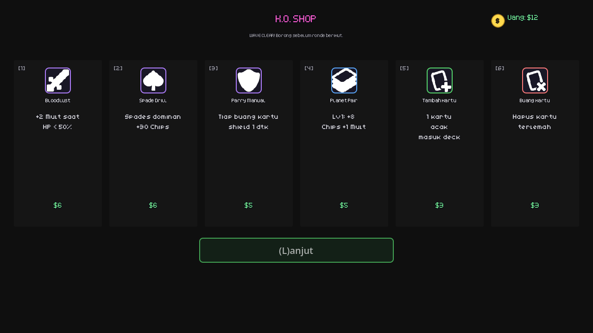
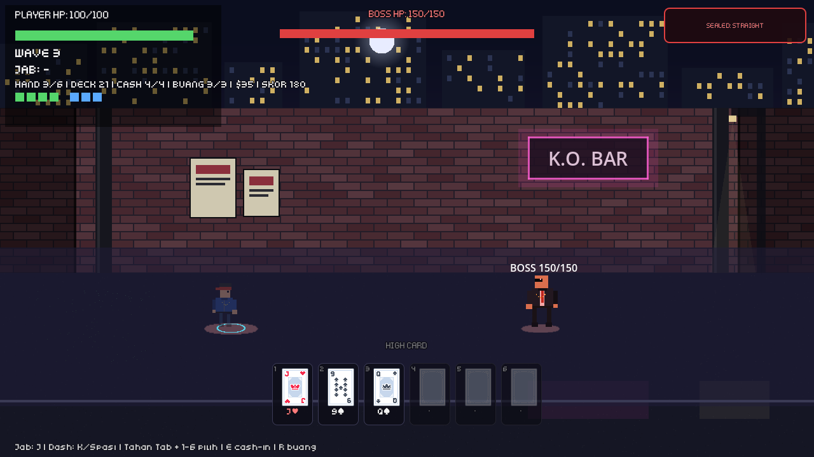

# Beat 'Em Fold

Beat 'em up + action-deckbuilder real-time. **Pukul = draw** — tiap jab yang kena narik 1 kartu, rakit poker hand tanpa jeda waktu, cash-in jadi jurus sesuai rank.



## Core Loop

1. **Berantem** — jab 3-hit, tiap kena = +1 kartu (maks 6 di tangan)
2. **Rakit** — tahan TAB + tombol 1-6 untuk pilih kartu, waktu tetap jalan
3. **Eksekusi** — lepas TAB + E: cash-in 2-5 kartu jadi AoE sesuai rank poker (Pair = single-lock, Flush = 360°, dst). Kosong = auto best-hand
4. **Belanja** — tiap wave clear: beli Joker, upgrade Planet, edit deck. Lalu wave berikutnya, endless + scaling

Damage ala Balatro: **Chips × Mult** + bonus suit (Hearts = lifesteal, Spades = damage, Clubs = stun, Diamonds = shield).



## Kontrol (keyboard penuh, mouse opsional)

| Aksi | Tombol |
|---|---|
| Gerak | WASD / Panah |
| Jab | J / Klik kiri |
| Dash (i-frame) | K / Spasi |
| Mode pilih kartu | Tahan Tab + 1-6 |
| Cash-In | E / Enter |
| Buang cepat | R |
| Shop | 1-6 beli, L lanjut |
| Pause / Ulangi / Menu | ESC / T / M |
| Tutorial | Y ya, N langsung main |
| Game over | C coba lagi, M menu |



## Fitur

- Endless run: Fight → Shop → Elite → Shop → Boss → scaling + seal boss rotasi (Straight/Flush/Pair)
- Musuh ber-AI: Striker, Dasher (lunge), Fury (double-hit), Slammer (mini-slam), Brute, Boss (slam + chase), token max 1-3 penyerang
- 3 Joker pasif, Planet per hand, deck 24 kartu custom + tambah/hapus di shop
- Tutorial 7 langkah terpandu, menu/pause/game-over, skor + best tersimpan
- Juice: hit-stop, screenshake, damage number, partikel, hitspark, SFX Kenney



## Jalanin

Butuh **Godot 4.7**. Buka folder ini di Godot → F5 (`scenes/main.tscn`).

## Struktur

```
scripts/   player, dummy (musuh+AI), deck, hand_manager, poker_evaluator,
           combat_manager (cash-in), wave_manager, run_manager,
           joker_data/manager, shop_ui, hand_ui, tutorial, alley_bg,
           thug_factory (sprite preman), ui_theme, ui_anim, key_button,
           sfx, pause_keys, char_sprites (hitspark), main (flow)
assets/    cards (Kenney), sfx (Kenney), icons (Kenney), fonts (Kenney),
           chars/bg (OGA), LICENSE-*.txt
tests/     test_step1-12 (smoke) + balance_report, dijalankan:
           godot --headless --path . -s tests/test_stepN.gd
docs/      GDD.md, DECISIONS.md, PROGRESS.md (desain, di folder root), shots/
```

Desain lengkap: [GDD.md](GDD.md), [keputusan](DECISIONS.md), [progres](PROGRESS.md).

## Aset (semua CC0)

- Kenney.nl: Playing Cards, Impact/Interface/Casino Audio, Board Game Icons, Fonts (`assets/LICENSE-kenney.txt`)
- Chewbatrij — Beat em Up Graphics Pack: hitspark (`assets/LICENSE-oga.txt`)
- Karakter preman + background gang: prosedural (ThugFactory, AlleyBg)
